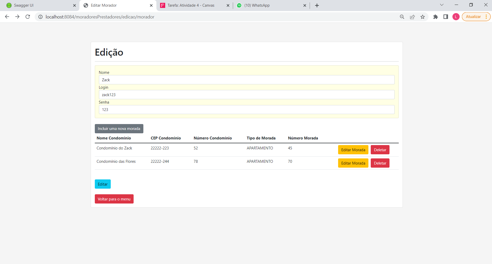

# Fase 3 atividade 1

Fala pessoal, o objetivo do projeto é montar 4 automações em `PL SQL` usando como base as funcionalidades que estamos desenvolvendo no nosso projeto principal, a aplicação `ConstruMax`.  Clique <a href="canvas/canvas.pdf">aqui</a> para saber mais sobre nossa proposta.

Nosso projeto final ainda está em desenvolvimento, por hora o que temos de funcionalidades são os seguintes itens:

* <b>Login</b>
* <b>Criar novo usuário</b>
* <b>Incluir uma nova Morada</b>
* <b>Alterar dados da Morada </b>
* <b>Alterar dados do Morador</b>

A seguir iremos mostrar como cada funcionalidade está sendo apresentada no projeto web e logo em seguida vamos apresentar como ela foi adaptada para a linguagem `PL SQL`.

Das 5 funcionalidades existentes vamos demonstrar neste projeto <b>login, criar novo usuário, incluir uma nova morada, alterar dados do morador</b>.

<h3>Criação do ambiente</h3>

Para realizar as demonstrações do projeto montamos um ambiente no banco da Oracle da FIAP com dados <b>mockados</b>.

Segue abaixo como ficou esquematizado as relações entre tabelas:


Para acessarem o banco utilizem essas credenciais:

<b>Login</b>: RM88633

<b>Senha</b>: 220295

Contudo fiquem a vontade para utilizar outro banco de sua escolha segue abaixo os scripts para preparar o ambiente:

* <a href="scripts SQL/criacaoDeTabelas.sql">Criação de tabelas</a>

* <a href="scripts SQL/inserts.sql">Inserção dos dados</a>

<hr>

<h3>Login</h3>

<b>O que ele faz:</b> Retorna um usuário ao informar login, senha e o tipo. A aplicação tem dois tipos de usuários moradores e prestadores, e dependendo do login e senha fornecidos, a requisição pode encaminha-los para áreas de usuario diferentes.


Além do acesso também adicionamos um tratamento de erro caso o usuário digite dados incorretos.


Segue <a href="img/web1.mp4">vídeo</a> onde mostro com mais detalhes essa funcionalidade.

<b>Login em programação PL SQL:</b> 

1. Montamos uma procedure de nome <a href="scripts SQL/sp_loginAccount.sql">sp_LOGINACCOUNT</a> da qual recebe os parâmetros login, senha e tipo de usuário. Dependendo do tipo de usuário ela irá acionar funções distintas.
2. Caso o usuário seja um morador a procedure chama a função <a href="scripts SQL/RetornaDadosMorador.sql">RETORNADADOSMORADOR</a> que retorna dados de um morador baseado no login e senha informados.
3. Caso o usuário seja um prestador a procedure chama a função <a href="scripts SQL/RetornaDadosPrestador.sql">RETORNADADOSPRESTADOR</a> que retorna dados de um prestador baseado no login e senha informados.
4. Colocamos tratamento de erros para as seguintes situações:
   * Caso o usuário tenha digitado um tipo inexistente
   * Caso o usuário tenha digitado senha ou login inválidos

Segue abaixo bloco que executa a procedure com exemplos. Lembre-se de tirar o comentário caso queria executar um dos exemplos listados.

````sql
-- SELECT * FROM TBL_MORADOR;
-- SELECT * FROM TBL_PRESTADOR;
SET SERVEROUTPUT ON

DECLARE v_resposta varchar(1000);

BEGIN
    -- Caso prestador
     sp_loginAccount('Julia123','123','PRESTADOR',v_resposta);
     DBMS_OUTPUT.PUT_LINE(v_resposta);
    
    -- Caso morador
    -- sp_loginAccount('Agatha1234','1234','MORADOR',v_resposta);
    -- DBMS_OUTPUT.PUT_LINE(v_resposta);
    
    -- ERRO1: Tipo de usuário inválido
    -- sp_loginAccount('Agatha1234','1234','LOCATÁRIO',v_resposta);
    -- DBMS_OUTPUT.PUT_LINE(v_resposta);
    
    -- ERRO2: login e/ou senha inválidos morador
    -- sp_loginAccount('Agatha123','123','MORADOR',v_resposta);
    -- DBMS_OUTPUT.PUT_LINE(v_resposta);
     
     -- ERRO3: login e/ou senha inválidos prestador
     -- sp_loginAccount('Julia1234','1234','PRESTADOR',v_resposta);
     -- DBMS_OUTPUT.PUT_LINE(v_resposta);
    
END;
````

<a href="scripts SQL/inicializa_func1.sql">Clique aqui</a> para ter acesso ao codigo listado acima.

Veja o <a href="img/sql1.mp4">vídeo</a> caso queira saber mais. 

<hr>

<H3>Criar novo usuário:</H3>

<b>O que ele faz:</b> Cria um novo usuário baseado nas informações passadas no formulário. Dependendo do tipo de usuário o sistema irá receber dados diferentes. Se o usuário for morador, além do nome, telefone, login e senha; o mesmo terá que informar dados de sua morada. Caso prestador terá que informar seu serviço.

<b>Caso Morador:</b>


<b>Caso Prestador:</b>


Da mesma forma que foi feito em login, colocamos um tratamento de erro caso não seja preenchido todos os campos


Segue <a href="img/web2.mp4">vídeo</a> onde mostro com mais detalhes essa funcionalidade.

<b>Criar novo usuário em programação PL SQL:</b> 

1. Montamos uma procedure de nome <a href="scripts SQL/sp_novousuario.sql">sp_novousuario</a> da qual recebe todos os dados referentes a prestador e morador. Dependendo do tipo de usuário ela irá direcionar para funções distintas apontando quais parâmetros serão utilizados.
2. Caso o usuário seja um morador a procedure chama a função <a href="scripts SQL/CriarMorador.sql">CriarMorador</a> que inclui um novo registro de morador ao banco.
3. Também foi criada as funções <a href="scripts SQL/INSERIRUSUARIO.sql">INSERIRUSUARIO</a>, <a href="scripts SQL/CHECKCONDOMINIO.sql">CHECKCONDOMINIO</a> e <a href="scripts SQL/CHECKMORADA.sql">CHECKMORADA</a> responsáveis por realizar a conferência dos dados.
4. Caso o usuário seja um morador a procedure chama a função <a href="scripts SQL/CriarPrestador.sql">CriarPrestador</a> que inclui um novo registro de prestador ao banco.
5. <a href="scripts SQL/CHECKSERVICO.sql">CHECKSERVICO</a> também realiza a conferência dos dados.
6. Colocamos tratamento de erros para as seguintes situações:
   * Tipo de usuário inválido
   * O usuário ja existe no banco
   * O tipo de serviço não existe
   * A morada já existe no banco

Segue abaixo bloco que executa a procedure com exemplos. Lembre-se de tirar o comentário caso queria executar um dos exemplos listados.

````sql
-- SELECT * FROM TBL_MORADOR ORDER BY id_morador DESC;
-- SELECT * FROM TBL_PRESTADOR ORDER BY id_prestador DESC;
-- SELECT * FROM TBL_USUARIO ORDER BY id_usuario DESC;
-- SELECT * FROM TBL_OCUPACAO ORDER BY id_prestador DESC;
-- SELECT * FROM tbl_registro_morada ORDER BY id_morador DESC;

-- DELETE FROM TBL_USUARIO WHERE login = 'Zack123';
-- DELETE FROM TBL_PRESTADOR WHERE nm_prestador = 'Zack';
-- DELETE FROM TBL_OCUPACAO WHERE id_prestador = 114;

-- DELETE FROM TBL_USUARIO WHERE login = 'Cody123';
-- DELETE FROM TBL_MORADOR WHERE nm_morador = 'Cody';
-- DELETE FROM tbl_registro_morado WHERE id_prestador = 1044;
SET SERVEROUTPUT ON

DECLARE v_resposta varchar(1000);

BEGIN
    -- Caso prestador
        /* sp_novousuario (
            p_login => 'Zack123',
            p_senha => '123',
            p_nome => 'Zack',
            p_telefone => '(021)22447-7155',
            p_tipo => 'PRESTADOR',
            p_servico => 'PINTOR',
            v_text_value => v_resposta
            );*/
            
    -- Caso morador
         /*sp_novousuario (
            p_login => 'Cody123',
            p_senha => '123',
            p_nome => 'Cody',
            p_telefone => '(021)22447-7171',
            p_tipo => 'MORADOR',
            p_num_morada => 30,
            p_tipo_morada => 'CASA',
            p_nome_condominio => 'Jardim Oceânico',
            p_num_condominio => 1000,
            p_endereco => 'Rua Douglas Silva',
            p_cep => '99999-999',
            v_text_value => v_resposta
            );*/
            
            
    -- ERRO 1: Tipo de usuario invalido
        /*sp_novousuario (
            p_login => 'Zack123',
            p_senha => '123',
            p_nome => 'Zack',
            p_telefone => '(021)22447-7155',
            p_tipo => 'LOCATÁRIO',
            p_servico => 'PINTOR',
            v_text_value => v_resposta
        );*/
    
    -- ERRO 2: Usuario já existe no banco
        /*sp_novousuario (
            p_login => 'Zack123',
            p_senha => '123',
            p_nome => 'Zack',
            p_telefone => '(021)22447-7155',
            p_tipo => 'PRESTADOR',
            p_servico => 'PINTOR',
            v_text_value => v_resposta
         );*/
         
    -- ERRO 3: O tipo de serviço não existe
        /*sp_novousuario (
            p_login => 'Zoe123',
            p_senha => '123',
            p_nome => 'Zoe',
            p_telefone => '(021)22447-3030',
            p_tipo => 'PRESTADOR',
            p_servico => 'CONFEITEIRO',
            v_text_value => v_resposta
         );*/
         
    -- ERRO 4: A Morada já existe no banco
        sp_novousuario (
            p_login => 'Benedita123',
            p_senha => '123',
            p_nome => 'Benedita',
            p_telefone => '(021)22447-4444',
            p_tipo => 'MORADOR',
            p_num_morada => 30,
            p_tipo_morada => 'CASA',
            p_nome_condominio => 'Jardim Oceânico',
            p_num_condominio => 1000,
            p_endereco => 'Rua Douglas Silva',
            p_cep => '99999-999',
            v_text_value => v_resposta
            );
    
    DBMS_OUTPUT.PUT_LINE(v_resposta);
    
END;

````

<a href="scripts SQL/inicializa_func2.sql">Clique aqui</a> para ter acesso ao codigo listado acima.

Veja o <a href="img/sql2.mp4">vídeo</a> caso queira saber mais. 

<hr>

<H3>Incluir uma nova Morada:</H3>

<b>O que ele faz:</b> Cria um novo registro de morada para um determinado morador. É acionado um modal de preenchimento dos dados da nova morada na aplicação. Uma vez criada, a morada irá surgir na página de edição de cadastro.


Assim como temos feito nas demais funcionalidade, colocamos um tratamento de erro caso seja adicionado uma morada com CEP e numero de morada já existente no banco.


Segue <a href="img/web3.mp4">vídeo</a> onde mostro com mais detalhes essa funcionalidade.

<b>Incluir uma nova Morada em programação PL SQL:</b> 

1. Montamos a procedure <a href="scripts SQL/sp_novamorada.sql">sp_novamorada</a> que vai receber os dados da nova morada junto com a identificação de login e senha do morador. 
2. A procedure chama a função <a href="scripts SQL/IncluirMorada.sql">IncluirMorada</a> que irá adiciona a nova morada no banco.
3. Também foi criada a função <a href="scripts SQL/INSERIRUSUARIO_V2.sql">INSERIRUSUARIO_V2</a> para realizar a conferência de acesso.
4. Colocamos tratamento de erros para as seguintes situações:
   * Usuário não existe
   * Morada já registrada no banco
   * Usuário inválido

Segue abaixo bloco que executa a procedure com exemplos. Lembre-se de tirar o comentário caso queria executar um dos exemplos listados.

````sql
-- SELECT * FROM TBL_USUARIO;
-- SELECT * FROM TBL_MORADOR;
-- SELECT * FROM TBL_CONDOMINIO;
-- DELETE FROM TBL_CONDOMINIO WHERE id_condominio = 11;
-- SELECT * FROM TBL_MORADA WHERE id_condominio = 11;
-- DELETE FROM TBL_MORADA WHERE id_condominio = 11;
-- SELECT * FROM TBL_REGISTRO_MORADA WHERE id_morada = 47;
-- DELETE FROM TBL_REGISTRO_MORADA WHERE id_morada = 47;

SET SERVEROUTPUT ON

DECLARE v_output_morador varchar(1000);
        v_resposta varchar(1000);
        
BEGIN
    -- Adição morada
    /*sp_loginAccount('Cody123','123','MORADOR',v_output_morador);
    DBMS_OUTPUT.PUT_LINE(v_output_morador);
    
    sp_novamorada('Cody123','123',78,'APARTAMENTO','Condominio Ibiza',
                    90,'Rua Ocean Drive', '66631-210',v_resposta);
    DBMS_OUTPUT.PUT_LINE(v_resposta);
    DBMS_OUTPUT.PUT_LINE('');
    sp_loginAccount('Cody123','123','MORADOR',v_output_morador);
    DBMS_OUTPUT.PUT_LINE(v_output_morador);*/
    
    -- Erro 1: Usuário não existente
    /*sp_novamorada('Benedita123','123',78,'APARTAMENTO','Condominio Ibiza',
                    90,'Rua Ocean Drive', '66631-210',v_resposta);
    DBMS_OUTPUT.PUT_LINE(v_resposta);*/
    
    -- Erro 2: Morada já registrada no banco de dados
    /*sp_novamorada('Cody123','123',78,'APARTAMENTO','Condominio Ibiza',
                    90,'Rua Ocean Drive', '66631-210',v_resposta);
    DBMS_OUTPUT.PUT_LINE(v_resposta);*/
    
    -- Erro 3: Usuário inválido
    sp_novamorada('Julia123','123',78,'CASA','Condominio Monaco',
                    97,'Rua Perdizes', '66631-212',v_resposta);
    DBMS_OUTPUT.PUT_LINE(v_resposta);
    
END;

````

<a href="scripts SQL/inicializa_func3.sql">Clique aqui</a> para ter acesso ao codigo listado acima.

Veja o <a href="img/sql3.mp4">vídeo</a> caso queira saber mais. 

<hr>

<h3>Alterar dados do Morador</h3>

<b>O que ele faz:</b> Altera todos os dados de um determinado morador. No exemplo web podemos alterar o login, senha e os demais dados de morada pela página de edição.



O usuário é obrigado a colocar algo nos campos, caso o contrário a edição não irá ocorrer.


Segue <a href="img/web4.mp4">vídeo</a> onde mostro com mais detalhes essa funcionalidade.

<b>Alterar dados do Morador em programação PL SQL:</b> 

1. Montamos a procedure <a href="scripts SQL/sp_atualizarmorador.sql">sp_atualizarmorador</a> que vai receber os novos dados de login, senha, nome, telefone e a chave primária do respectivo morador. 
2. A procedure chama a função <a href="scripts SQL/AtualizarMorador.sql">AtualizarMorador</a> que irá alterar os dados do morador no banco.
3. Foi colocado o seguinte tratamento de erro:
   * Morador não encontrado
4. Também montamos uma outra versão da funcionalidade (<a href="scripts SQL/SP_ATUALIZA_MORADOR.sql">SP_ATUALIZA_MORADOR</a>) que atualiza tanto os dados de morador quanto os dados de sua morada. 
5. Foi colocado o seguinte tratamento de erro nesse caso:
   * Caso o id de morador não seja informado

Segue abaixo bloco que executa a procedure com exemplos. Lembre-se de tirar o comentário caso queria executar um dos exemplos listados.

````sql
-- SELECT * FROM TBL_MORADOR
/* UPDATE TBL_MORADOR SET nm_morador = 'Agatha', telefone = '(021)49781-4026'
        WHERE id_morador = 1;*/
/* UPDATE TBL_USUARIO SET login = 'Agatha123', senha = '123'
        WHERE id_usuario = 1;*/
        
SET SERVEROUTPUT ON

DECLARE v_output_morador varchar(1000);
        v_resposta varchar(1000);
        
BEGIN
    -- Atualizar Morador
    /*sp_loginAccount('Agatha123','123','MORADOR',v_output_morador);
    DBMS_OUTPUT.PUT_LINE(v_output_morador);
    
    sp_atualizarmorador(1,'Agatha1234','1234','Agatha Christie'
                        ,'(011)49781-4026',v_resposta);
    DBMS_OUTPUT.PUT_LINE(v_resposta);
    DBMS_OUTPUT.PUT_LINE('');
    sp_loginAccount('Agatha1234','1234','MORADOR',v_output_morador);
    DBMS_OUTPUT.PUT_LINE(v_output_morador);*/
    
    -- ERRO : Morador não encontrado ou inválido
    /*sp_atualizarmorador(111,'Agatha1234','1234','Agatha Christie'
                        ,'(011)49781-4026',v_resposta);
    DBMS_OUTPUT.PUT_LINE(v_resposta);*/
    
    -- Atualiza morador V2
    
    /*sp_loginAccount('Ana123','123','MORADOR',v_output_morador);
    DBMS_OUTPUT.PUT_LINE(v_output_morador);
    
    SP_ATUALIZA_MORADOR(8, 'Ana Flor','(021)07012-42670','CASA',7,5);
    
    sp_loginAccount('Ana123','123','MORADOR',v_output_morador);
    DBMS_OUTPUT.PUT_LINE(v_output_morador);*/
    
    -- ERRO 2: ID morador digitado incorretamente
    
    -- SP_ATUALIZA_MORADOR(null, 'Ana Flor','(021)07012-42670','CASA',7,5);
    
END;


````

<a href="scripts SQL/inicializa_func4.sql">Clique aqui</a> para ter acesso ao codigo listado acima.

Veja o <a href="img/sql4.mp4">vídeo</a> caso queira saber mais. 

<b>Obs do vídeo:</b> Vocês vão estranhar que na primeira procedure, a Agatha apareceu com uma morada a mais após a alteração. Olhei no banco e sem querer coloquei mais de um morador chamado "Agatha Christie" com o mesmo login e senha. Já mudei o dado no banco e esse erro não deve se repetir

<h3>FORTE ABRAÇO</h3>


  